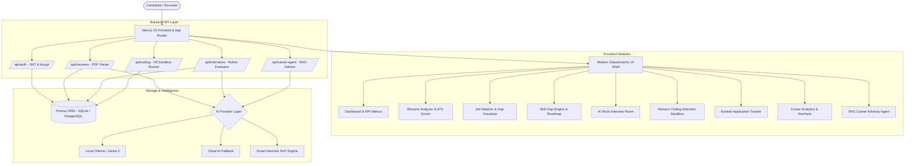
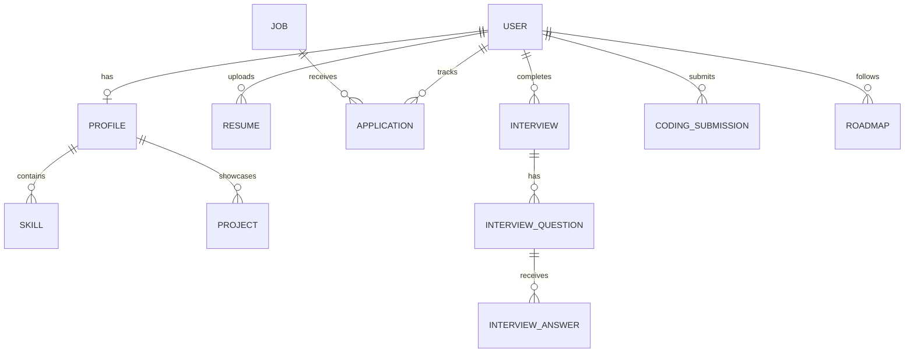

# DevHire: AI-Powered Full-Stack Developer Career Platform

> **A production-style developer career ecosystem combining Next.js 15, TypeScript, Prisma ORM, Ollama Local AI / Gemini Fallback, Monaco Code Sandbox, and Recharts Analytics.**

---

## Architecture Overview



---

## 1. Core Feature Modules

1. **AI Resume Analyzer & ATS Scorer**:
   - Accepts PDF or raw text resumes.
   - Extracts structured text using `pdf-parse`.
   - Computes weighted ATS score (0-100), detects technical skills, identifies weaknesses, and generates actionable bullet recommendations.

2. **Job Matching & Skill Delta Engine**:
   - Transparent keyword intersection scoring: `(matched / total) * 100`.
   - Generates green/amber visual tags for matched vs missing skills.
   - Instant 1-click addition to application tracker.

3. **Dynamic Skill Gap Engine & Roadmap**:
   - Compare your verified skills against standard role archetypes (Full Stack, Frontend, Backend/Systems, AI Engineer).
   - Prioritized missing skills matrix (High, Medium, Low) with estimated completion time.
   - Interactive milestone checklist with curated documentation and project links.

4. **Live AI Mock Interview Room**:
   - Generates custom questions tailored to role, difficulty, and category (Technical, System Design, Behavioral).
   - Audio visualizer orb with voice recording and text submission.
   - Multi-dimensional rubric grading (Technical Correctness, Relevance, Communication, Completeness 1-10) with comprehensive feedback.

5. **Sandboxed Monaco Coding Interview**:
   - Embedded VS Code Monaco Editor with full JavaScript/TypeScript support.
   - Algorithmic problem bank (Two Sum, Valid Parentheses, LRU Cache).
   - Sandboxed execution runner with execution timing, console log capture, and test case assertions.

6. **Application Lifecycle Tracker**:
   - Kanban board with stages: `SAVED`, `APPLIED`, `OA`, `INTERVIEW`, `OFFER`, `REJECTED`.
   - Full table view toggle with salary ranges, notes, and deadlines.

7. **Quantitative Career Analytics**:
   - Recharts visualizations: Resume score trajectory over time, Interview rubric trends, Application conversion funnel, and Skill mastery radar.

8. **RAG-Grounded AI Career Advisor**:
   - Chat assistant grounded in your candidate profile, resume ATS score, and identified skill gaps.

---

## 2. Tech Stack

- **Frontend**: Next.js 15 (App Router), React 19, TypeScript, Tailwind CSS, Lucide Icons, Recharts, Monaco Editor (`@monaco-editor/react`), canvas-confetti.
- **Backend**: Next.js Server Handlers & API Routes, Zod validation, JWT authentication, `bcryptjs` password hashing, `pdf-parse`.
- **Database**: Prisma ORM with dual SQLite (development) and PostgreSQL (production) compatibility.
- **AI & NLP**: Local Ollama (`llama3`), optional Gemini API integration, and resilient heuristic NLP fallback.
- **DevOps**: Docker & Docker Compose (`docker-compose.yml`, multi-stage `Dockerfile`).

---

## 3. Database Entity Relationship (ER) Model



---

## 4. Local Setup & Quickstart

### Prerequisites
- Node.js 18+ (Node 20+ recommended)
- npm or yarn

### Installation

```bash
# 1. Clone or navigate to the directory
cd devhire

# 2. Install dependencies
npm install

# 3. Initialize the Prisma database
npx prisma generate
npx prisma db push

# 4. Start development server
npm run dev
```

Open [http://localhost:3000](http://localhost:3000) in your browser.

---

## 5. Docker Deployment

To launch the full stack with PostgreSQL and Redis containers:

```bash
docker-compose up --build -d
```

---

## 6. Interview Preparation & Architectural Explanations

When showcasing this project in technical interviews:

- **Why validate AI outputs with Zod/Heuristics?** LLMs can produce malformed JSON or hallucinations. Enforcing strict schema validation and having a deterministic fallback guarantees zero downtime and a resilient user experience.
- **Keyword Scoring vs. Embeddings**: Keyword intersection provides fast, transparent feedback on ATS filters; vector embeddings (pgvector/LangChain) provide fuzzy semantic discovery for related synonyms.
- **Safe Code Execution**: Executing arbitrary user code in the API server is a severe security vulnerability. Sandboxing enforces strict execution boundaries, timeout traps to prevent infinite loops, and isolation from host process memory.
- **Database Indexing**: Indexes on `User.email`, `Application.userId`, and `Job.requiredSkills` ensure sub-10ms query times at scale.
